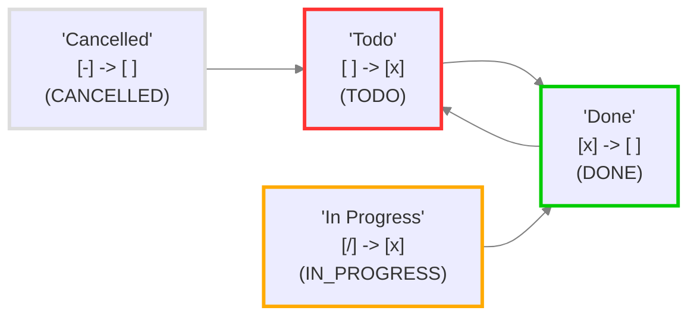

# Просмотреть и проверить свои статусы

## Об этом файле

Этот файл был создан плагином Obsidian Tasks (версия 7.22.0), чтобы помочь визуализировать статусы задач в этом хранилище.

Если вы измените настройки статусов Tasks, вы можете получить обновленный отчет, выполнив следующие действия:

- Перейдите в `Settings` -> `Tasks`.
- Нажмите на `Review and check your Statuses`.

Вы можете удалить этот файл в любое время.

## Настройки статусов

<!--
Переключитесь в режим Live Preview или Reading Mode, чтобы увидеть таблицу.
Если в именах статусов есть какие-либо символы форматирования Markdown, такие как '*' или '_',
Obsidian может правильно отобразить таблицу только в режиме Reading Mode.
-->

Это значения статусов в разделах Core и Custom статусов.

| Символ статуса | Символ следующего статуса | Имя статуса | Тип статуса | Проблемы (если есть) |
| ----- | ----- | ----- | ----- | ----- |
| `space` | `x` | Todo | `TODO` |  |
| `x` | `space` | Done | `DONE` |  |
| `/` | `x` | In Progress | `IN_PROGRESS` |  |
| `-` | `space` | Cancelled | `CANCELLED` |  |

## Загруженные настройки

<!-- Переключитесь в режим Live Preview или Reading Mode, чтобы увидеть диаграмму. -->

Это настройки, которые фактически используются Tasks.




## Примеры Задач

Вот по одной строке-примеру задачи для каждого статуса, фактически используемого плагином, чтобы вы могли поэкспериментировать.

Символы и названия статусов в описаниях задач были корректны на момент создания этого файла.

Если вы изменили примеры задач с момента их создания, вы можете увидеть текущие типы и названия статусов в заголовках групп в поиске Tasks ниже.

> [!Tip] Подсказка: Если все ваши чекбоксы выглядят одинаково...
> Если все чекбоксы выглядят одинаково в режиме чтения (Reading Mode) или предпросмотра (Live Preview), см. [Стилизация пользовательских статусов](https://publish.obsidian.md/tasks/How+To/Style+custom+statuses), чтобы узнать, как выбрать тему или CSS-фрагмент (snippet) для стилизации ваших статусов.

- [ ] Sample task 1: status symbol=`space` status name='Todo'
- [x] Sample task 2: status symbol=`x` status name='Done'
- [/] Sample task 3: status symbol=`/` status name='In Progress'
- [-] Sample task 4: status symbol=`-` status name='Cancelled'

## Поиск по примерам задач

Этот поиск Tasks показывает все задачи в этом файле, сгруппированные по типу и названию их статуса.

```tasks
path includes {{query.file.path}}
group by status.type
group by status.name
sort by function task.lineNumber
hide postpone button
short mode
```
